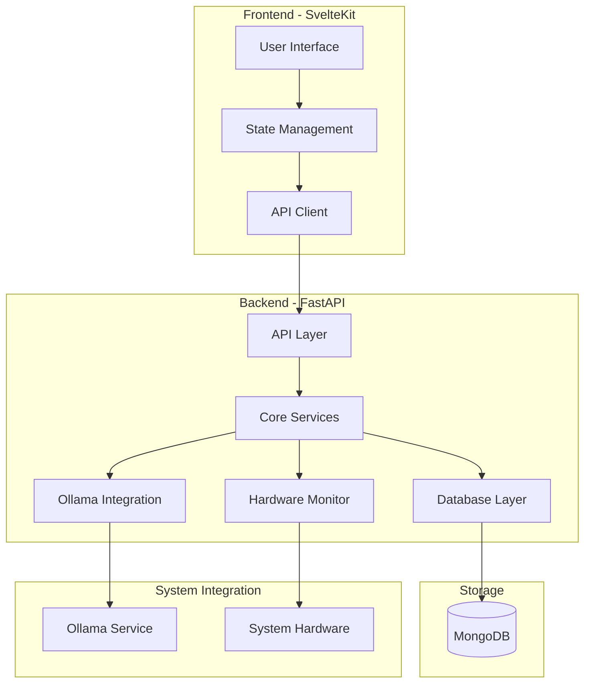
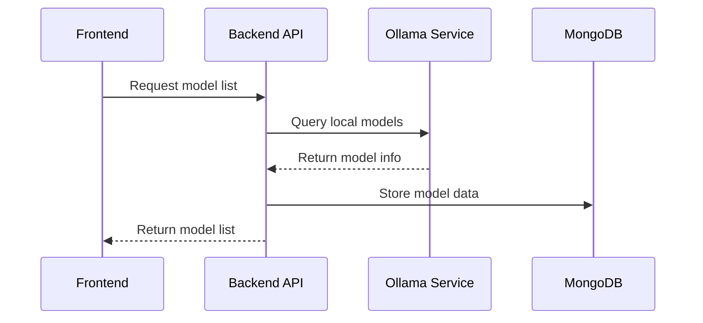
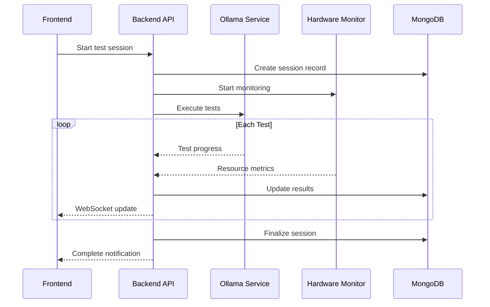
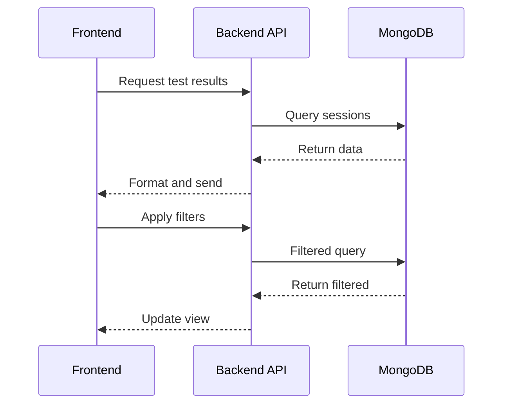

# Architecture Overview

## System Components

## Component Details

### Frontend (SvelteKit)
- **User Interface**
  - Dark-themed, responsive design
  - Model selection interface
  - Dashboard with search/filter
  - Test results visualization
- **State Management**
  - Svelte stores for local state
  - WebSocket connection for real-time updates
- **API Client**
  - REST API communication
  - WebSocket handling
  - Error management

### Backend (FastAPI)
- **API Layer**
  - REST endpoints
  - WebSocket connections
  - Request validation
  - Error handling
- **Core Services**
  - Test orchestration
  - Result processing
  - Hardware monitoring
- **Database Layer**
  - MongoDB interaction
  - Data validation
  - Query optimization
- **Ollama Integration**
  - Model discovery
  - Test execution
  - Result collection
- **Hardware Monitor**
  - System information collection
  - Resource usage tracking
  - Performance metrics

### Storage (MongoDB)
- Hardware configurations
- Test sessions
- Test results
- Model information

### System Integration
- **Ollama Service**
  - Local installation
  - Model management
  - Test execution
- **System Hardware**
  - CPU/GPU metrics
  - Memory usage
  - System information

## Data Flow

1. **Model Discovery**

2. **Test Execution**

3. **Dashboard View**

## Security Considerations

1. **API Security**
   - Rate limiting
   - Input validation
   - Error handling

2. **Data Security**
   - MongoDB authentication
   - Secure connections
   - Data validation

3. **System Access**
   - Limited system permissions
   - Controlled Ollama access
   - Resource usage limits

## Scalability

1. **Horizontal Scaling**
   - Stateless backend
   - MongoDB replication
   - Load balancing

2. **Performance**
   - Query optimization
   - Caching strategies
   - Efficient data storage

3. **Resource Management**
   - Concurrent test limits
   - Memory usage control
   - Disk space management
